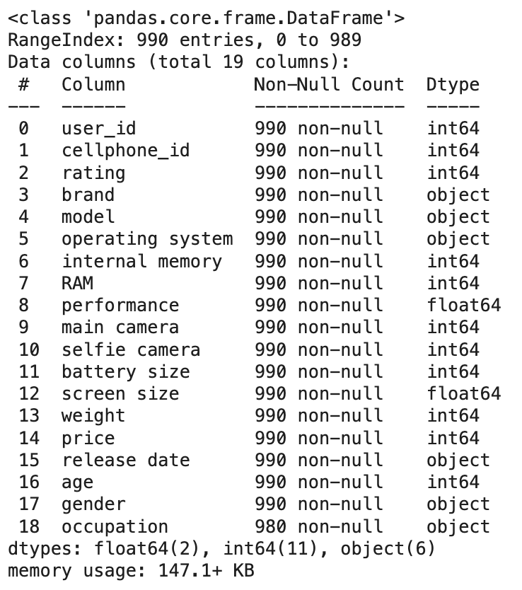

# Laporan Proyek Machine Learning - Syafei Karim

## Project Overview

Seiring dengan pesatnya perkembangan teknologi, industri smartphone telah berkembang menjadi salah satu sektor yang paling dinamis dan kompetitif. Beragam merek dan model smartphone terus diperkenalkan ke pasaran, masing-masing menawarkan fitur dan spesifikasi yang beragam untuk memenuhi kebutuhan pengguna yang beragam. Dengan banyaknya pilihan ini dapat menjadi keuntungan, namun juga menjadi tantangan tersendiri dalam menentukan smartphone yang paling sesuai dengan kebutuhan dan anggaran pengguna.

Di sisi lain, preferensi dan kebutuhan pengguna terhadap smartphone berbeda-beda, mulai dari yang mengutamakan performa, kualitas kamera, kapasitas baterai, hingga kapasitas penyimpanan. Pemilihan smartphone yang tidak tepat dapat mengakibatkan ketidakpuasan, yang pada akhirnya akan berdampak pada pengalaman pengguna. Oleh karena itu, dibutuhkan sebuah sistem yang dapat membantu konsumen dalam menyaring dan memilih produk smartphone berdasarkan preferensi dan kebutuhan spesifik mereka.

Sistem rekomendasi smartphone hadir sebagai solusi untuk membantu pengguna dalam proses pemilihan smartphone. Sistem ini dirancang untuk memberikan rekomendasi produk yang paling relevan dengan kebutuhan dan preferensi pengguna, dengan mempertimbangkan berbagai faktor seperti spesifikasi, harga, dan ulasan dari pengguna lain. Dengan memanfaatkan teknologi seperti machine learning dan analisis data, sistem rekomendasi ini mampu memberikan saran yang akurat dan personal kepada pengguna. 

Penelitian yang dilakukan oleh Priskila et.al ```[1]``` melakukan sistem rekomendasi smartphone android menggunakan Collaborative Filtering dan Content-Based Filtering. Sistem ini merekomendasikan smartphone berdasarkan fitur dan spesifikasi yang relevan dengan kebutuhan pengguna. Ini memungkinkan pengguna untuk mendapatkan rekomendasi yang lebih personal. Penelitian menunjukkan bahwa kombinasi metode Collaborative Filtering dengan Content-Based Filtering menghasilkan sistem rekomendasi yang baik dengan nilai MAPE sebesar 12,87%. Penelitian lain juga dilakukan oleh Sebastian et.al ```[2]``` dengan menggunakan Content-Based Filtering. Metode ini menganalisis preferensi pengguna lain untuk merekomendasikan smartphone. Misalnya, sistem dapat merekomendasikan smartphone berdasarkan kesamaan rating antara pengguna

Melalui sistem rekomendasi smartphone, diharapkan pengguna dapat lebih mudah, cepat, dan efisien dalam menemukan perangkat yang ideal, sehingga mereka dapat mengambil keputusan pembelian yang tepat. 
  
[1] [Penerapan Metode Collaborative Filtering dan Content Based Filtering Pada Sistem Rekomendasi Smartphone Android](https://ojs.uniska-bjm.ac.id/index.php/JIT/article/view/15255)

[2] [Sistem Rekomendasi Pembelian Smartphone](https://pdfs.semanticscholar.org/e0df/bf47194668a9186c3efe884f80b8afefd29a.pdf)

## Business Understanding

Pengembangan sistem rekomendasi smartphone bertujuan untuk memahami dengan jelas apa yang ingin diselesaikan dan bagaimana sistem ini dapat memberikan solusi yang sesuai.

### Problem Statements

- Bagaimana caranya membantu pengguna untuk menemukan ponsel yang paling sesuai dengan kebutuhan dan preferensi?
- Bagaimana caranya membantu pengguna untuk menemukan ponsel yang mirip dengan ponsel lamanya?

### Goals

- Mengembangkan sistem rekomendasi yang dapat memberikan daftar ponsel terbaik berdasarkan preferensi pengguna.
- Membangun sistem rekomendasi yang dapat memberikan daftar ponsel terbaik berdasarkan model ponsel lamanya (Contoh: ```Moto G Play (2021)```).


    ### Solution statements
    - Content-Based Filtering
    - Collaborative Filtering

## Data Understanding
**Informasi Dataset**
      
| Jenis  | Keterangan |
| ------------- |-------------|
| Title      | Cellphones Recommendations |
| Source      | [Kaggle](https://www.kaggle.com/datasets/meirnizri/cellphones-recommendations/data) |
| Maintainer      | Meir Nizri |
| License | Database: Open Database |
| Visibility | Publik |
| Tags | Pre-Trained Model, Electronics, E-commerce Services, Mobile and Wireless, System Recommendations |
| Usability | 10.00 |

Dataset terbagi menjadi 3 yaitu cellphones data, cellphones rating, dan cellphones users.

**Univariate Exploratory Data Analysis**

Pada tahap ini melakukan analisis dan eksplorasi setiap variabel pada data.

Menampilkan 5 data dari dataset data

```data.head()```


```data.info()```


Dari eksekusi method ```data.info()``` di atas kita dapat melihat bahwa pada dataset ini terdapat 14 kolom.

* Data terdiri dari 33 baris dan 14 kolom
* Terdapat 8 kolom numerik dengan tipe data int64 yaitu: cellphone_id, internal memory, RAM, main camera, selfie camera, battery size, weight, dan price.
* Terdapat 2 kolom dengan tipe data float64 yaitu: performance, screen size.
* Terdapat 1 kolom dengan tipe data object yaitu: release date

Penjelasan tiap kolom:
* ```cellphone_id:``` ID unik untuk setiap ponsel.
* ```brand:``` Merek ponsel.
* ```model:``` Model ponsel.
* ```operating system:``` Sistem operasi ponsel.
* ```internal memory:``` Memori internal ponsel dalam GB.
* ```RAM:``` RAM ponsel dalam GB.
* ```performance:``` Skor kinerja ponsel.
* ```main camera:``` Resolusi kamera utama dalam MP.
* ```selfie camera:``` Resolusi kamera depan dalam MP.
* ```battery size:``` Kapasitas baterai dalam mAh.
* ```screen size:``` Ukuran layar dalam inci.
* ```weight:``` Berat ponsel dalam gram.
* ```price:``` Harga ponsel dalam USD.
* ```release date:``` Tanggal rilis ponsel.

Menampilkan 5 data dari dataset users

```users.head()```


```users.info()```


Dari eksekusi method ```users.info()``` di atas kita dapat melihat bahwa pada dataset ini terdapat 4 kolom.

* Data memiliki 99 baris dan 4 kolom
* Terdapat 2 kolom numerik dengan tipe data int64 yaitu: user_id, dan age.
* Terdapat 2 kolom dengan tipe data object yaitu: gender dan occupation.

Penjelasan tiap kolom:
* ```user_id:``` ID unik untuk setiap pengguna.
* ```age:``` Usia pengguna.
* ```gender:``` Jenis kelamin pengguna.
* ```occupation:``` Pekerjaan pengguna.

Menampilkan 5 data dari dataset rating

```rating.head()```


```rating.info()```


Dari eksekusi method rating.info() di atas kita dapat melihat bahwa pada dataset ini terdapat 3 kolom.

* Data memiliki 990 baris dan 3 kolom
* semua kolom memiliki tipe data int64 yaitu: user_id, cellphone_id, dan rating.

Penjelasan tiap kolom:
* ```user_id:``` ID unik untuk setiap pengguna.
* ```cellphone_id:``` ID unik untuk setiap ponsel (mengacu pada cellphones_data).
* ```rating:``` Rating yang diberikan pengguna untuk ponsel tertentu (skala 1-10).

**Dataset Data**

Menghitung jumlah brand dan cellphone pada masing-masing brand.
        
    Banyak brand:  10
    Tipe brand:  ['Apple' 'Asus' 'Samsung' 'Google' 'OnePlus' 'Oppo' 'Vivo' 'Xiaomi' 'Sony' 'Motorola']


Berdasarkan gambar diatas terdapat:
* jumlah brand sebanyak 10
* Samsung adalah brand terbanyak
* Asus, Oppo, Vivo, Sony adalah brand paling sedikit

Menampilkan jumlah model
    
    Banyak model:  33
    Tipe model:  ['iPhone SE (2022)' 'iPhone 13 Mini' 'iPhone 13' 'iPhone 13 Pro' 'iPhone 13 Pro Max' 'iPhone XR' 'Zenfone 8' 'Galaxy A13' 'Galaxy A32' 'Galaxy A53' 'Galaxy S22' 'Galaxy S22 Plus' 'Galaxy S22 Ultra' 'Galaxy Z Flip 3' 'Galaxy Z Fold 3' 'Pixel 6 \xa0' 'Pixel 6a' 'Pixel 6 Pro\xa0' 'Nord N20' 'Nord 2T' '10 Pro' '10T' 'Find X5 Pro' 'X80 Pro' 'Redmi Note 11' '11T Pro' '12 Pro' 'Poco F4' 'Xperia Pro' 'Moto G Stylus (2022)' 'Moto G Play (2021)' 'Moto G Pure' 'Moto G Power (2022)']

Model cellphones ada 33 model. Terdapat 2 kategori operating system: Android dan iOS.

Menampilkan internal memory dari setiap model.


Berdasarkan gambar diatas terdapat:
* 5 kategori internal memory
* total ada 20 dengan kategori internal memory 128
* hanya ada 1 dengan kategori internal memory 512

Menampilkan RAM dari setiap model.


Berdasarkan gambar diatas terdapat:
* 5 kategori RAM
* total ada 13 dengan kategori RAM 8GB
* kategori 3GB dan 12GB memiliki jumlah paling sedikit dengan total 4

**Dataset Users**

Distribusi umur pengguna


Berdasarkan hasil diatas:
* Umur paling muda adalah 21 tahun
* Umur paling tua adalah 61 tahun

Distribusi gender pengguna


Berdasarkan hasil diatas:
* Gender Male sebanyak 50
* Gender Female sebanyak 46
* Terdapat outliers yaitu ```-Select Gender-``` sebanyak 3

Distribusi jenis pekerjaan pengguna

* Jumlah pekerjaan sebanyak 45 jenis pekerjaan
* Terdapat kesalahan pada penulisan ```healthare```
* Pekerjaan ```it``` dan ```information technology``` dapat dijadikan satu

**Dataset Rating**

Menampilkan jumlah kemunculan rating


Dari output diatas terdapat:
* skala rating 1-10
* rating terendah adalah 1
* rating tertinggi adalah 10
* terdapat nilai outliers yaitu nilai rating 18

## Data Preparation
Data Preparation adalah tahap untuk mempersiapkan data sebelum masuk ke tahap pembuatan model Machine Learning.

1. Menggabungkan dataset data, users, rating menjadi satu.
    
    
    Hasil output diatas merupakan hasil dari penggabungan dataset data, rating, dan user.
2. Melakukan pengecekan missing value pada dataset Terdapat 10 missing value pada kolom ```occupation```
3. Menghapus data yang memiliki nilai outliers pada kolom ```rating``` yang memiliki value 18.
4. Menghapus outlier pada kolom ```gender``` yang memiliki value ```-Select Gender-```.
5. Value pada kolom ```occupation``` dibuat menjadi lowercase
6. Terdapat beberapa penulisan yang salah pada kolom ```occupation```. Value 'Healthare' menjadi 'healthcare' dan value 'it' menjadi 'information technology'.
7. Membuang data duplikat pada kolom ```cellphone_id```
8. Membuat dictionary untuk menentukan pasangan key-value pada data cellphone_id, brand, model, dan operating system. TF-IDF hanya cocok untuk data teks maka hanya kolom yang bertipe object saja yang dipilih.
```python
phone_new = pd.DataFrame({
    'cellphone_id': cellphone_id,
    'brand': brand,
    'model': model,
    'operating_system': operating_system,
})

phone_new.head()
```


**Alasan Tahapan Data Preparation***

* Handling Missing Values untuk memastikan tidak ada data yang hilang yang dapat mempengaruhi hasil analisis dan model.
* Removing outliers untuk meningkatkan akurasi model dengan menghilangkan data yang dapat mempengaruhi performa model.
* Mereplace value untuk mengubah beberapa nilai karena memiliki kesalahan penulisan.

## Modeling
Pada tahap ini menggunakan dua pendekatan yaitu Content-Based Filtering dan Collaborative Filtering.

**Model Development Dengan Content Based Filtering**

```python
data = phone_new
data.head()
```
Membangun sistem rekomendasi dengan menggunakan ```TfidfVectorizer()```.
```python 
#Melakukan perhitungan idf pada data brand
tf.fit(data['brand'])
```
Selanjutnya, lakukan fit dan transformasi ke dalam bentuk matriks.
```python
# Melakukan fit lalu ditransformasikan ke bentuk matrix
tfidf_matrix = tf.fit_transform(data['brand'])

# Melihat ukuran matrix tfidf
tfidf_matrix.shape
```
Matriks memiliki ukuran (33, 10). Nilai 33 merupakan ukuran data dan 10 merupakan matrik kategori brand.

Menghitung derajat kesamaan (similarity degree) dengan teknik cosine similarity.
```python
# Menghitung cosine similarity pada matrix tf-idf
cosine_sim = cosine_similarity(tfidf_matrix)
cosine_sim
```

**Membuat Rekomendasi**

membuat fungsi ```resto_recommendations``` dengan beberapa parameter sebagai berikut:

* ```model``` : Nama model (index kemiripan dataframe).
* ```similarity_data``` : Dataframe mengenai similarity yang telah kita definisikan sebelumnya.
* ```items``` : Nama dan fitur yang digunakan untuk mendefinisikan kemiripan, dalam hal ini adalah ```'model'```, ```'brand'``` dan ```'operating_system'```.
* ```k``` : Banyak rekomendasi yang ingin diberikan.

```python
def model_recommendations(model, similarity_data=cosine_sim_df, items=data[['model', 'brand', 'operating_system']], k=5):
        # Mengambil data dengan menggunakan argpartition untuk melakukan partisi secara tidak langsung sepanjang sumbu yang diberikan
    # Dataframe diubah menjadi numpy
    # Range(start, stop, step)
    index = similarity_data.loc[:,model].to_numpy().argpartition(
        range(-1, -k, -1))

    # Mengambil data dengan similarity terbesar dari index yang ada
    closest = similarity_data.columns[index[-1:-(k+2):-1]]

    # Drop nama_resto agar nama resto yang dicari tidak muncul dalam daftar rekomendasi
    closest = closest.drop(model, errors='ignore')

    return pd.DataFrame(closest).merge(items).head(k)
```
```python
#Menampilkan hasil rekomendasi
model_recommendations('Moto G Play (2021)')
```


**Model Development dengan Collaborative Filtering**

Model Development dengan Collaborative Filtering menghasilkan rekomendasi sejumlah model yang sesuai dengan preferensi pengguna berdasarkan rating yang telah diberikan sebelumnya. 

1. Melakukan persiapan data untuk menyandikan (encode) fitur ```'user_id'``` dan ```'cellphone_id'``` ke dalam indeks integer.
2. Petakan userID dan cellphoneID ke dataframe yang berkaitan
3. Membagi data untuk training (80%) dan validasi (20%). Kemudian memetakan (mapping) data user dan cellphone menjadi satu value terlebih dahulu. Lalu, buatlah rating dalam skala 0 sampai 1 agar mudah dalam melakukan proses training.
```python
# Membuat variabel x untuk mencocokkan data user dan cellphone menjadi satu value
x = df[['user', 'cellphone']].values

# Membuat variabel y untuk membuat rating dari hasil
y = df['rating'].apply(lambda x: (x - min_rating) / (max_rating - min_rating)).values

# Membagi menjadi 80% data train dan 20% data validasi
train_indices = int(0.8 * df.shape[0])
x_train, x_val, y_train, y_val = (
    x[:train_indices],
    x[train_indices:],
    y[:train_indices],
    y[train_indices:]
)
```
4. Melakukan proses training dengan membuat class ```RecommenderNet``` dengan keras Model class.
```python
class RecommenderNet(tf.keras.Model):
    ...
    ...
```

- Inisialisasi model menggunakan RecommenderNet dengan nilai embedding 50
- Compile model menggunakan:
    - loss = BinaryCrossentropy
    - optimizer = Adam
    - learning_rate = 0.001
    - metrics = RootMeanSquaredError
- Melakukan training model menggunakan:
    - batch_size = 8
    - epochs = 100

Menampilkan hasil rekomendasi pada user 128:

```python
Showing recommendations for users: 128
===========================
cellphone with high ratings from user
--------------------------------
Vivo : X80 Pro
Samsung : Galaxy A32
Apple : iPhone 13 Pro Max
Samsung : Galaxy Z Fold 3
Xiaomi : Redmi Note 11
--------------------------------
Top 10 cellphone recommendation
--------------------------------
Apple : iPhone XR
Samsung : Galaxy S22
Oppo : Find X5 Pro
Apple : iPhone 13 Pro
Apple : iPhone 13 Mini
Xiaomi : 11T Pro
OnePlus : 10 Pro
Apple : iPhone SE (2022)
Google : Pixel 6 Pro 
Apple : iPhone 13
```

## Evaluation
Metrik evaluasi yang digunakan pada model ini adalah Root Mean Squared Error (RMSE) yang menghitung akar kuadrat dari rata-rata kuadrat kesalahan. Ini memberikan gambaran seberapa jauh prediksi model berbeda dari nilai sebenarnya dalam satuan yang sama dengan variabel yang diprediksi.


Keterangan:
- $y_i$ adalah nilai sebenarnya
- $\hat y_i$ adalah nilai prediksi
- $n$ adalah jumlah observasi
- RMSE yang kecil mengindikasikan bahwa model memiliki performa yang baik karena kesalahan antara prediksi dan nilai aktual rendah.
- RMSE yang besar mengindikasikan bahwa model memiliki performa yang buruk karena kesalahan antara prediksi dan nilai aktual tinggi.

Hasil RMSE


|            | Train | Test  |
|------------|-------|-------|
| RMSE       |0.2013|0.2793|

RMSE yang dihitung memberikan indikasi bahwa model prediksi rating memiliki tingkat kesalahan yang dapat diterima, sehingga memadai untuk tujuan rekomendasi.


